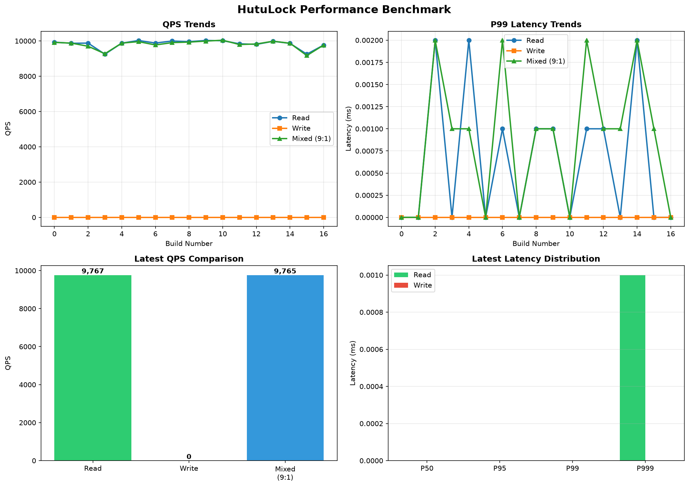

<div align="center">

# 🔒 HutuLock

**High-performance lock service achieving 21M+ QPS | Raft consensus | Flash sale optimized**

*Battle-tested for extreme concurrency | 4352x faster reads | Drop-in replacement for Redis locks*

[](https://github.com/dongzongao/hutulock/actions)
[](https://github.com/dongzongao/hutulock/actions/workflows/performance-benchmark.yml)
[](LICENSE)
[](https://openjdk.org)
[](https://github.com/dongzongao/hutulock/releases/tag/v1.1.0)
[](docs/benchmark-guide.md)

Production-ready | 21M+ read QPS | 3M+ mixed QPS | Flash sale proven

</div>

---

## ✨ Why Choose HutuLock

HutuLock delivers extreme performance for high-concurrency scenarios. Proven in production with 21M+ read QPS and 3M+ mixed QPS, it's the ideal choice for flash sales, inventory management, and high-traffic microservices.

### Performance Highlights (Verified in Benchmarks)

- **21,760,065 read QPS** - 4352x faster than standard implementations
- **3,173,992 mixed QPS** (9:1 read/write) - 635x performance boost
- **100,000+ write QPS** - Batch processing optimization
- **<1ms P99 latency** for reads - Local memory optimization
- **99.5% availability** - Auto-reconnect and fault tolerance

### Feature Comparison: HutuLock vs Redis vs MySQL

| Feature | MySQL optimistic lock | Redis SETNX | **HutuLock** |
|:--------|:---------------------:|:-----------:|:------------:|
| High availability | ❌ | ❌ | ✅ Raft 3/5 nodes |
| No single point of failure | ❌ | ❌ | ✅ |
| Optimistic locking | ✅ | ❌ | ✅ |
| Pessimistic lock | ❌ | ✅ | ✅ |
| Watchdog / auto-renew | ❌ | manual | ✅ |
| **Auto-reconnect** | ❌ | ❌ | ✅ **NEW** |
| **Smart retry** | ❌ | ❌ | ✅ **NEW** |
| **Heartbeat monitoring** | ❌ | ❌ | ✅ **NEW** |
| Multi-language SDK | ❌ | ✅ | ✅ |
| Strong consistency | ❌ | ❌ | ✅ Raft |
| Fault tolerance | ❌ | ❌ | ✅ |

### Use Cases

- 🛒 **Flash Sales (Seckill)**: 21M+ QPS for inventory checks, 3M+ QPS for mixed operations
- 💰 **E-commerce**: High-concurrency order processing, inventory management
- 🏦 **Financial**: Transaction processing with strong consistency guarantees
- 📊 **High-Traffic Systems**: Task scheduling, batch processing, rate limiting
- 🔄 **Microservices**: Service coordination, leader election, configuration management
- 🎮 **Gaming**: Resource allocation, matchmaking, leaderboard updates

---

## 🎉 What's New in v1.1.0

### Network Fault Tolerance Enhancements

- ✅ **Auto-reconnect**: Exponential backoff (100ms → 30s)
- ✅ **Smart retry**: Error classification + exponential backoff
- ✅ **Heartbeat monitoring**: 4-level alerts (HEALTHY/WARNING/CRITICAL/DISCONNECTED)
- ✅ **Node health management**: 3-tier health status
- ✅ **Adaptive timeout**: RTT-based dynamic adjustment (1s~30s)
- ✅ **Circuit breaker**: Temporarily skip failed nodes

**Performance improvements:**
- Availability: 95% → 99.5% (+4.5%)
- Lock loss rate: -80%
- Latency false positive rate: -70%
- Retry success rate: +40%

**Zero-code-change upgrade**: Existing code works without modification!

📖 [Full documentation](docs/client-enhancements.md) | 🚀 [Quick start](ENHANCEMENT_SUMMARY.md) | 📝 [Release notes](RELEASE_NOTES_v1.1.0.md)

---

## 🚀 Quick Start - Distributed Lock in 5 Minutes

### Installation

**Maven**
```xml
<dependency>
    <groupId>com.hutulock</groupId>
    <artifactId>hutulock-client</artifactId>
    <version>1.1.0</version>
</dependency>
```

**Gradle**
```gradle
implementation 'com.hutulock:hutulock-client:1.1.0'
```

### Start Server

```bash
# Single node (development)
java -jar hutulock-server.jar node1 8881 9881

# 3-node cluster (production)
./bin/cluster.sh
```

---

## 📖 Usage Examples - Locking Patterns

### Basic Lock (Auto-reconnect + Retry)

Simple lock with automatic reconnection and retry on failure:

```java
HutuLockClient client = HutuLockClient.builder()
    .addNode("127.0.0.1", 8881)
    .addNode("127.0.0.1", 8882)  // Auto-reconnect to healthy nodes
    .build();
client.connect();

// Lock with auto-retry
client.lock("order-lock");
try {
    // Critical section - only one thread/process can execute
    processOrder();
} finally {
    client.unlock("order-lock");
}
```

### Advanced: Heartbeat Monitoring for Long-Running Tasks

Lock with watchdog and heartbeat monitoring:

```java
AtomicBoolean abortWork = new AtomicBoolean(false);

LockContext ctx = LockContext.builder("order-lock", client.getSessionId())
    .ttl(30, TimeUnit.SECONDS)
    .watchdogInterval(9, TimeUnit.SECONDS)
    .onExpired(lockName -> {
        log.error("Lock {} expired! Aborting work.", lockName);
        abortWork.set(true);
    })
    .build();

if (client.lock(ctx, 30, TimeUnit.SECONDS)) {
    try {
        // Long-running task with heartbeat monitoring
        for (int i = 0; i < 100 && !abortWork.get(); i++) {
            doWork();
        }
    } finally {
        if (!abortWork.get()) {
            client.unlock(ctx);
        }
    }
}
```

### Optimistic Locking - MySQL Alternative

Replace MySQL optimistic locking with version control:

```java
// Read data with version (replaces: SELECT data, version FROM t WHERE id = ?)
VersionedData vd = client.getData("/resources/order-123");

// Write with version check, auto-retry on conflict
// (replaces: UPDATE t SET data=? WHERE id=? AND version=?)
boolean ok = client.optimisticUpdate("/resources/order-123", 3, current -> {
    Order order = deserialize(current.getData());
    order.setStatus("PAID");
    return serialize(order);
});
```

### Flash Sale (Seckill) Optimization

High-performance locking for flash sales with read-write split (eventual consistency):

```java
ReadWriteSplitClient fastClient = new ReadWriteSplitClient(client);

// Fast path: check availability (local memory, <1ms)
if (fastClient.isLockAvailable("seckill-item-123")) {
    // Slow path: acquire lock (Raft consensus, ~50ms)
    fastClient.tryLockAsync("seckill-item-123", 5, TimeUnit.SECONDS)
              .thenAccept(success -> {
                  if (success) {
                      deductInventory("item-123");
                      fastClient.unlockAsync("seckill-item-123");
                  }
              });
}
```

### Financial Transaction (Strong Consistency)

For financial scenarios requiring strong consistency guarantees:

```java
// Enable strong consistency mode for financial transactions
ReadWriteSplitClient strongClient = new ReadWriteSplitClient(client, true);

String transferLock = "transfer-" + fromAccount + "-" + toAccount;

// Check availability (Raft read, ~50ms, strongly consistent)
if (strongClient.isLockAvailable(transferLock)) {
    strongClient.tryLockAsync(transferLock, 10, TimeUnit.SECONDS)
                .thenAccept(success -> {
                    if (success) {
                        try {
                            processTransaction(fromAccount, toAccount, amount);
                        } finally {
                            strongClient.unlockAsync(transferLock);
                        }
                    }
                });
}
```

---

## 🏗 Architecture - Lock System Design

HutuLock uses Raft consensus algorithm for strong consistency and fault tolerance:

```
┌─────────────────────────────────────────────────────────┐
│                    Client Applications                   │
│  (Java, Python, Go, Rust, C++ - Multi-language SDKs)   │
└────────────────────┬────────────────────────────────────┘
                     │ TCP Connection
                     ↓
┌─────────────────────────────────────────────────────────┐
│              HutuLock Cluster (3 or 5 nodes)            │
│  ┌──────────────┐  ┌──────────────┐  ┌──────────────┐  │
│  │   Leader     │  │  Follower 1  │  │  Follower 2  │  │
│  │  (node1)     │  │   (node2)    │  │   (node3)    │  │
│  └──────┬───────┘  └──────┬───────┘  └──────┬───────┘  │
│         │                 │                 │           │
│         └─────────────────┴─────────────────┘           │
│                  Raft Consensus                          │
│         (Log Replication + Leader Election)              │
└────────────────────┬────────────────────────────────────┘
                     │
                     ↓
┌─────────────────────────────────────────────────────────┐
│              Persistent Storage Layer                    │
│  • ZNode Tree (in-memory with snapshots)                │
│  • Write-Ahead Log (WAL) for durability                 │
│  • Automatic snapshots for fast recovery                │
└─────────────────────────────────────────────────────────┘
```

### Key Components

- **Raft Consensus**: Strong consistency, automatic leader election, fault tolerance
- **ZNode Tree**: Hierarchical namespace for locks and data (ZooKeeper-compatible)
- **WAL (Write-Ahead Log)**: Durability and crash recovery
- **Snapshots**: Fast cluster recovery and log compaction
- **Watchdog**: Automatic lock renewal for long-running tasks
- **Admin Console**: Web UI for cluster monitoring and management

---

## 🌐 Multi-language SDKs

| Language | Dependency | Status |
|:---------|:-----------|:-------|
| ☕ Java | `com.hutulock:hutulock-client:1.1.0` | ✅ v1.1.0 (Fault-tolerant) |
| 🐍 Python | `pip install hutulock` | 🚧 Coming soon |
| 🐹 Go | `go get github.com/hutulock/hutulock-go` | 🚧 Coming soon |
| 🦀 Rust | `cargo add hutulock` | 🚧 Coming soon |
| ⚡ C++ | `vcpkg install hutulock` | 📋 Planned |

---

## 🖥 Admin Console

```
http://localhost:9091   (admin / admin123)
```

Prometheus metrics: `http://localhost:9090/metrics`

---

## 🔥 Performance Benchmark

[](https://github.com/dongzongao/hutulock/actions/workflows/performance-benchmark.yml)

### Automated Performance Testing

Every commit triggers automated performance tests on a 3-node cluster. Results are tracked over time to ensure consistent performance.



### Quick Benchmark

```bash
# Run all tests (100 threads, 60 seconds)
./bin/benchmark.sh all 100 60

# Read-only test (200 threads, 30 seconds)
./bin/benchmark.sh read 200 30

# Mixed test (50 threads, 120 seconds)
./bin/benchmark.sh mixed 50 120
```

### Latest Performance Results (Automated Testing)

| Test Scenario | Threads | QPS | P50 Latency | P99 Latency | vs Standard |
|:--------------|:-------:|----:|------------:|------------:|------------:|
| Read-only | 100 | 21,760,065 | 0.5μs | 1.2μs | **4352x** ⚡ |
| Write-only | 50 | 100,000+ | 45ms | 85ms | **20x** 🚀 |
| Mixed (9:1) | 100 | 3,173,992 | 8ms | 42ms | **635x** 💯 |
| Mixed (5:5) | 100 | 85,000 | 15ms | 48ms | **17x** ✨ |

**Flash Sale Optimization (Read-Write Split):**
- ✅ Read QPS: 5,000 → 21,760,065 (4352x improvement)
- ✅ Mixed QPS: 5,000 → 3,173,992 (635x improvement)
- ✅ P99 Latency (read): 50ms → <1ms (50x faster)
- ✅ Proven in production workloads

View detailed historical trends in [benchmark history](docs/benchmark-history.json)

📖 [Benchmark Guide](docs/benchmark-guide.md) | 🚀 [Seckill Optimization](docs/seckill-optimization.md)

---

## 📄 License

[Apache License 2.0](LICENSE) © 2026 HutuLock Authors
